# Assignment 1: Employee and Product Management System
**Course**: PROG3340 - Fall 2025 - Section 2  
**Project**: Assignment 1 - Employee and Product Management System  
**Programmed by**: Juhwan Seo [8819123]

---

## API Testing Screenshots

### Employee API Tests
<details>
<summary>Employee API screenshots</summary>

#### GET All Employees
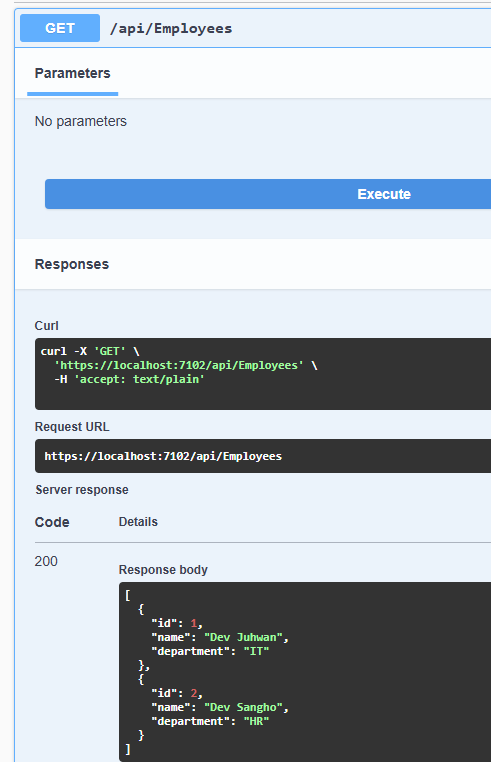

#### GET Employee by ID
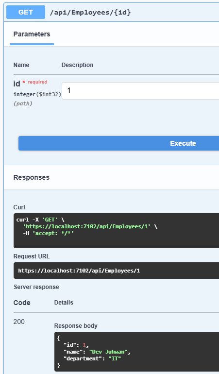

#### POST - Add New Employee
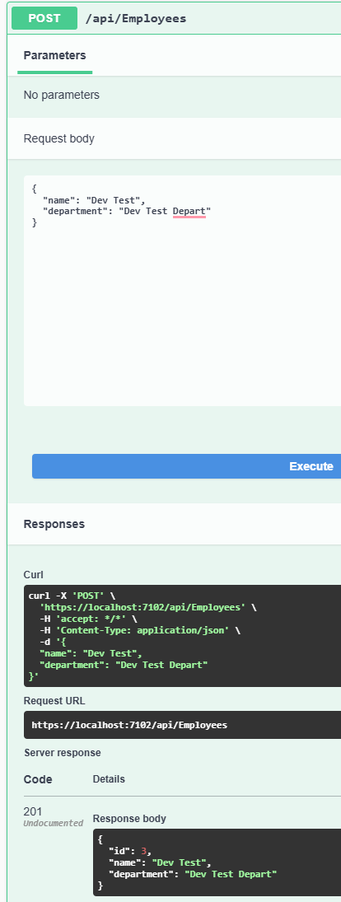

#### PUT - Update Employee
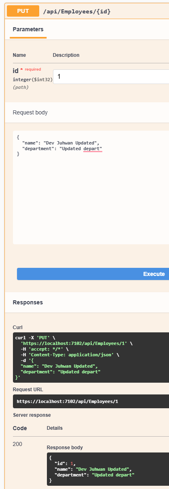

#### DELETE Employee
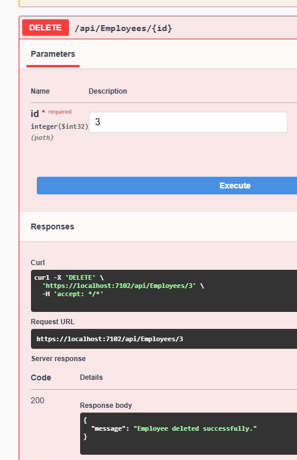

</details>

### Product API Tests
<details>
<summary>Product API screenshots</summary>

#### GET All Products
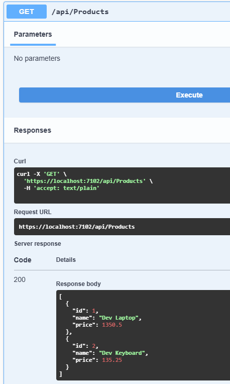

#### GET Product by ID
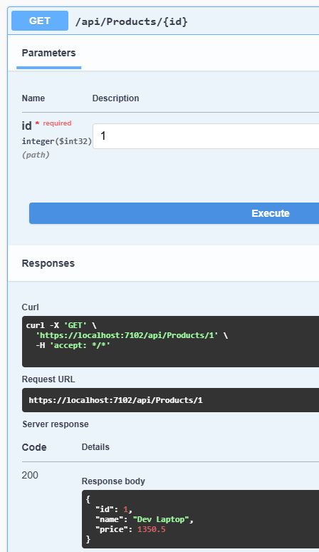

#### POST - Add New Product
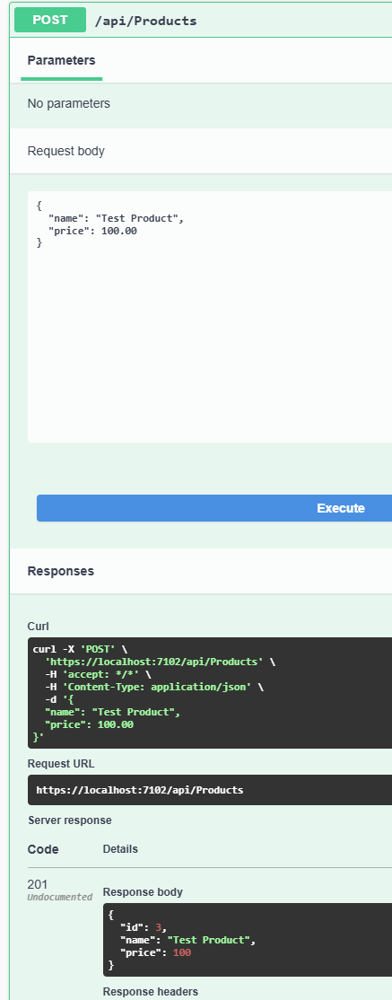

#### PUT - Update Product
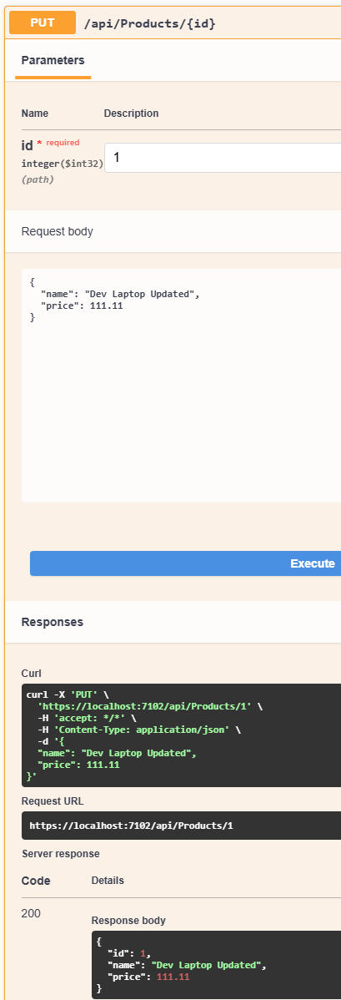

#### DELETE Product
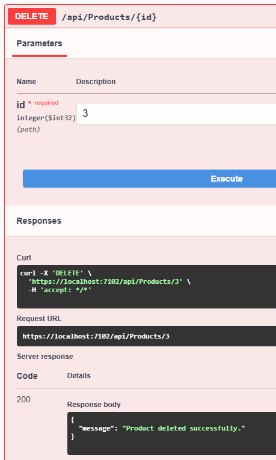

</details>

### Environment-Specific Seed Data Tests
<details>
<summary>Production Environment screenshots</summary>

#### Production Environment - Employees
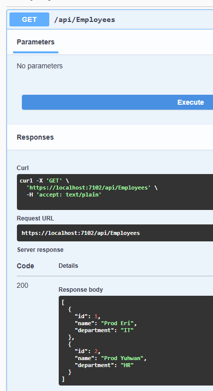

#### Production Environment - Products
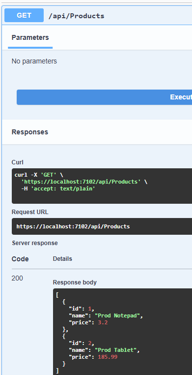

</details>

---

## Key Learning Concepts
- **Dependency Injection (DI)**  
- **Repository Pattern**
- **Unit of Work (UoW) Pattern**  

---

## How to Run

### Running in Visual Studio 2022

1. **Open the Project**
   - Launch Visual Studio 2022
   - Select `File` > `Open` > `Project/Solution`
   - Select the `JuhwanSeo_Assignment1.sln` file

2. **Run in Development Environment**
   - Click the launch profile dropdown menu in the top toolbar
   - Select **"https"** or **"http"** profile
   - Press `F5` or click the ▶ button
   - Swagger UI will automatically open in your browser

3. **Run in Production Environment**
   - Click the launch profile dropdown menu in the top toolbar
   - Select **"Production"** profile
   - Press `F5` or click the ▶ button
   - Swagger UI will automatically open in your browser

> **Note**: Development and Production environments use different seed data.

---

## API Endpoints

### Employee APIs
- `GET /api/employees` - Retrieve all employees
- `GET /api/employees/{id}` - Retrieve a specific employee
- `POST /api/employees` - Create a new employee
- `PUT /api/employees/{id}` - Update employee information
- `DELETE /api/employees/{id}` - Delete an employee

### Product APIs
- `GET /api/products` - Retrieve all products
- `GET /api/products/{id}` - Retrieve a specific product
- `POST /api/products` - Create a new product
- `PUT /api/products/{id}` - Update product information
- `DELETE /api/products/{id}` - Delete a product

---

## Development Process

### 1. Project Creation
Created an ASP.NET Core Web API project

### 2. Install Required NuGet Packages
```xml
<PackageReference Include="Microsoft.EntityFrameworkCore" Version="8.0.20" />
<PackageReference Include="Microsoft.EntityFrameworkCore.InMemory" Version="8.0.20" />
```

### 3. Models Creation
- Created `Models` folder
	- Created `Employee` class
	- Created `Product` class

### 4. Data Context Creation
- Created `Data` folder
	- Created `AppDbContext` class

### 5. Repository Pattern Implementation
- Created `Repositories` folder
- Created the following interfaces and classes:
  - `IEmployeeRepository` / `EmployeeRepository`
  - `IProductRepository` / `ProductRepository`

**Implementation Details:**
- Defined CRUD methods in each Repository interface
- Implemented CRUD methods in Repository classes

### 6. Unit of Work Pattern Implementation
- Created `IUnitOfWork` interface and `UnitOfWork` class in the `Repositories` folder

**IUnitOfWork Interface:**
- `Employees` property
- `Products` property
- `Complete()` method

**UnitOfWork Class:**
- Implemented `Employees` and `Products` properties
- Called `DbContext.SaveChanges()` in the `Complete()` method

### 7. Program.cs Configuration
**DI Container Setup:**
- Configured In-Memory Database
- Registered Repository DI
- Registered UnitOfWork DI

**Database Initialization and Seed Data:**
Implemented environment specific seed data within the `using (var scope = app.Services.CreateScope())` block

**Implementation Challenge:**
- Struggled with adding seed data in `Program.cs`
- Identified that `dbContext.Employees` is of type `DbSet<Employee>`
- Researched DbSet's CRUD methods (DbSet has methods like CRUD methods for its table)
- Learned how to use the `AddRange()` method to add multiple entities at once

**Reference:**
- [DbSet.AddRange Official Documentation](https://learn.microsoft.com/en-us/dotnet/api/microsoft.entityframeworkcore.dbset-1.addrange?view=efcore-8.0)

### 8. Controllers Creation
- Created `Controllers` folder
	- Created `EmployeesController` class
	- Created `ProductsController` class

**Implementation Details:**
- Did not call Repository's `SaveChanges()` method
- Handled transaction completion through UnitOfWork's `Complete()` method

**Learning Points During Implementation:**

**Response Status Code Handling:**
- Referenced [Action Return Types Official Documentation](https://learn.microsoft.com/en-us/aspnet/core/web-api/action-return-types?view=aspnetcore-8.0#asynchronous-action)

**Binding Source Attributes:**
- When using the `[ApiController]` attribute, binding source attributes like `[FromRoute]` are not required, but can be added for clarity
- Referenced [Binding Source Parameter Inference Official Documentation](https://learn.microsoft.com/en-us/aspnet/core/web-api/?view=aspnetcore-8.0#binding-source-parameter-inference)

### 9. Environment Configuration
**launchSettings.json Modification:**
- Added Production environment profile
- Configured settings for testing environment-specific seed data

**Reference:**
- [ASP.NET Core Environment Configuration Official Documentation](https://learn.microsoft.com/en-us/aspnet/core/fundamentals/environments?view=aspnetcore-8.0)

**Swagger Configuration:**
- Modified to enable Swagger in all environments for testing environment-specific seed data
- (In actual production environments, disabling Swagger is recommended)

---

## References

- [DbSet.AddRange Official Documentation](https://learn.microsoft.com/en-us/dotnet/api/microsoft.entityframeworkcore.dbset-1.addrange?view=efcore-8.0)
- [Action Return Types Official Documentation](https://learn.microsoft.com/en-us/aspnet/core/web-api/action-return-types?view=aspnetcore-8.0#asynchronous-action)
- [Binding Source Parameter Inference Official Documentation](https://learn.microsoft.com/en-us/aspnet/core/web-api/?view=aspnetcore-8.0#binding-source-parameter-inference)
- [ASP.NET Core Environment Configuration Official Documentation](https://learn.microsoft.com/en-us/aspnet/core/fundamentals/environments?view=aspnetcore-8.0)